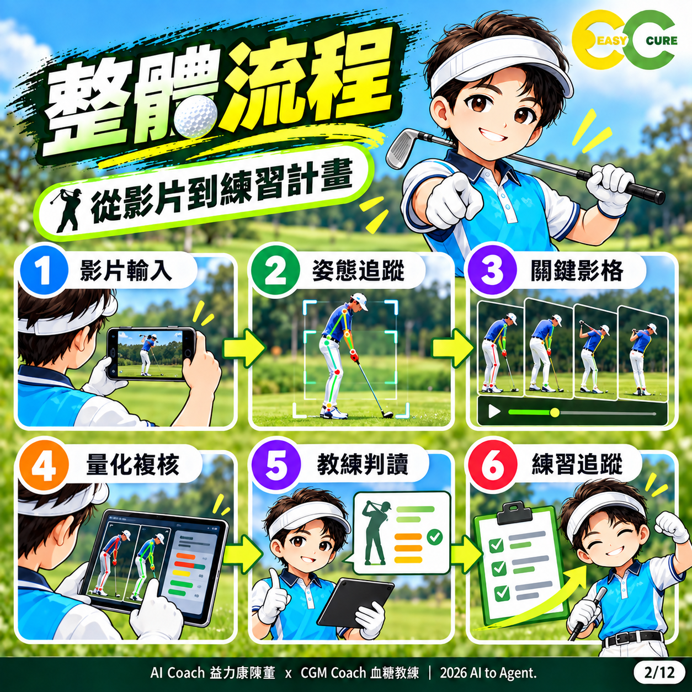
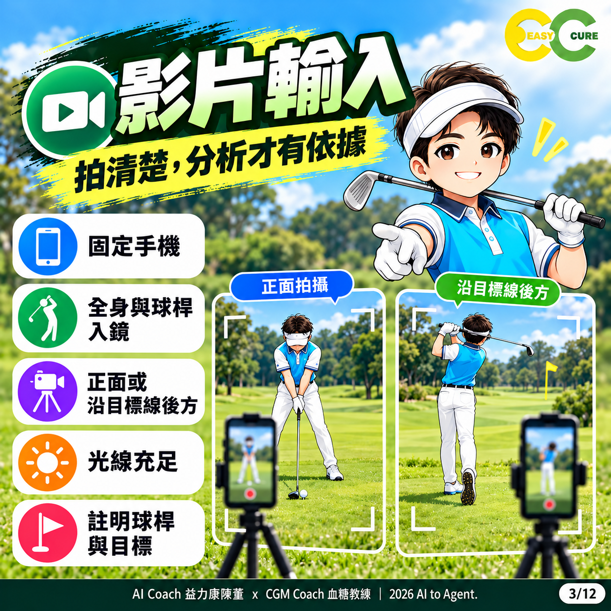
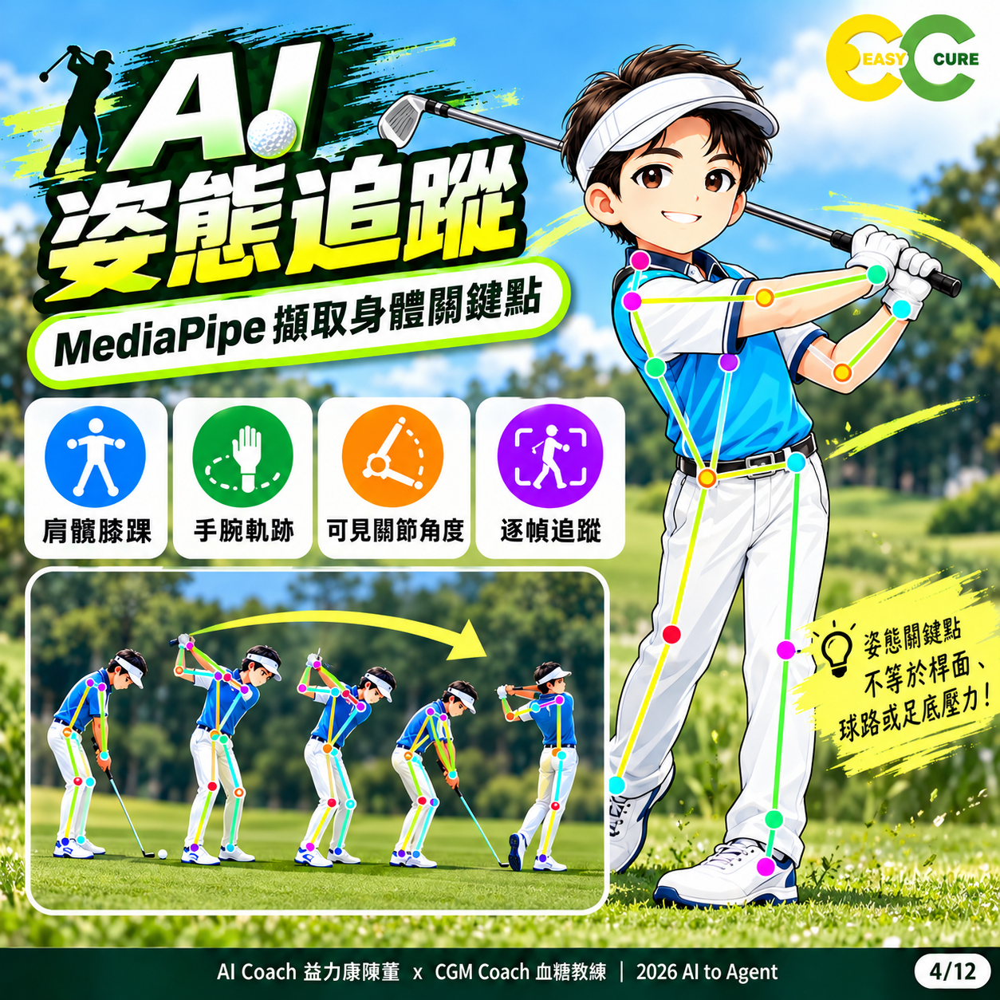
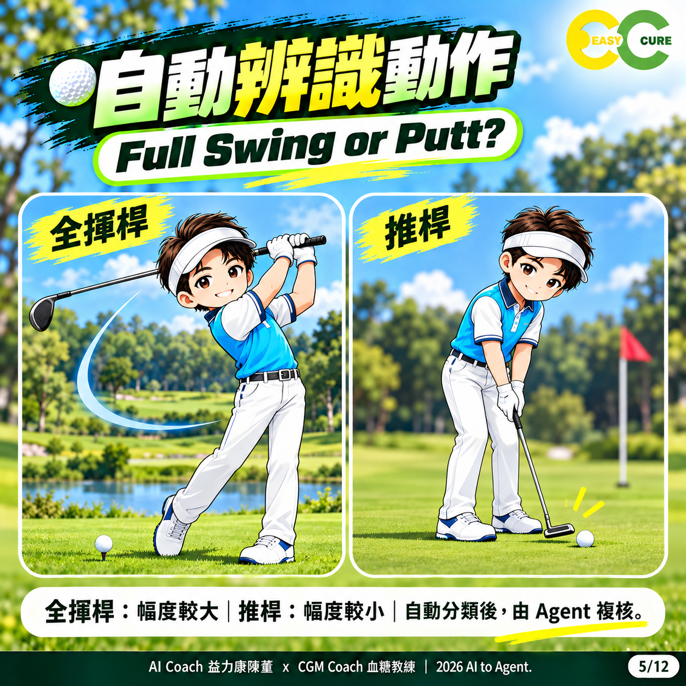
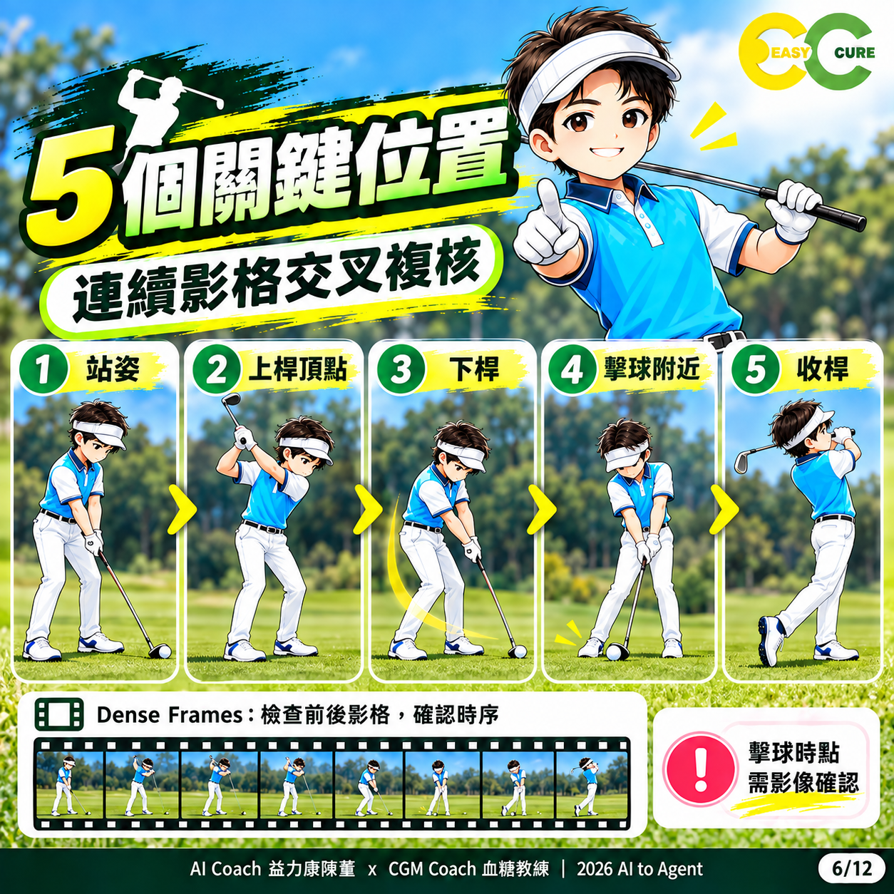
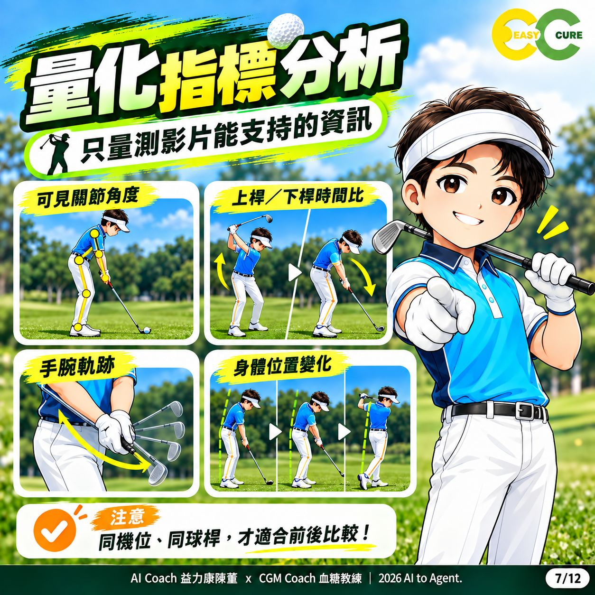
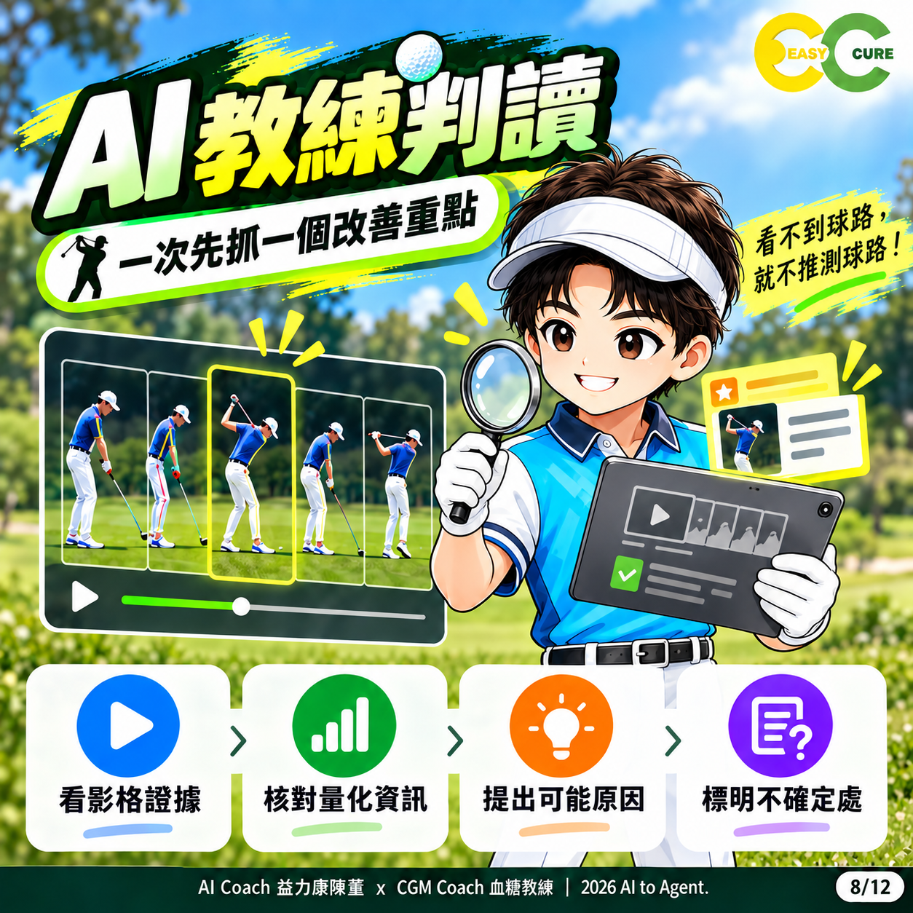
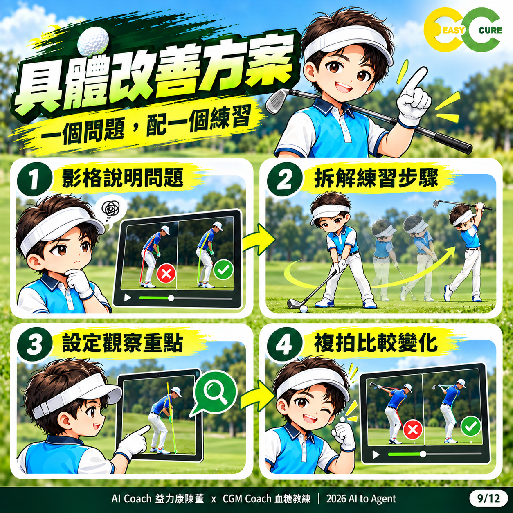
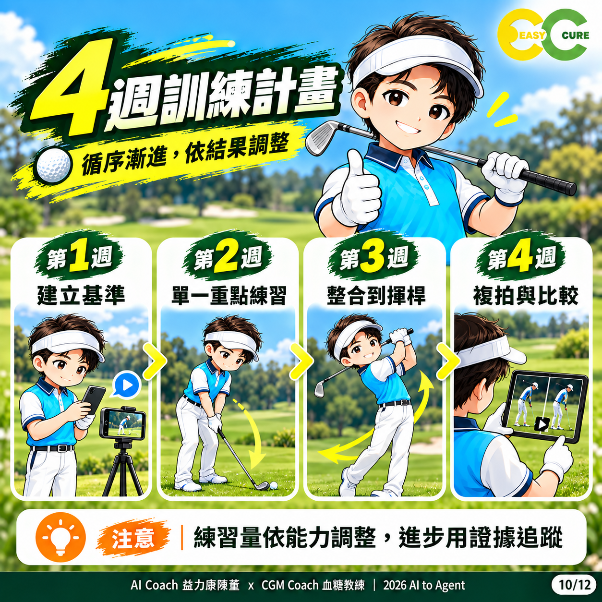
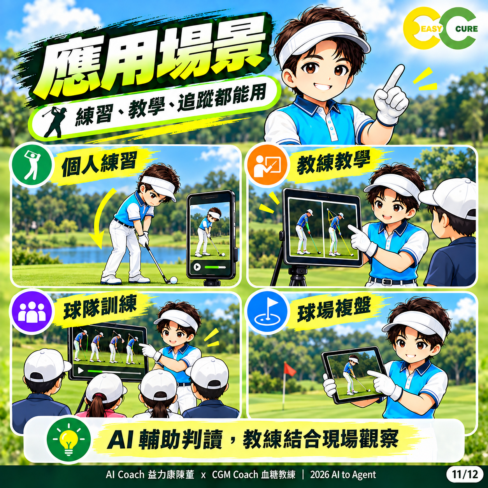

# 12 張知識圖卡

版本 3.1.0｜揮映活力 SwingFrame

所有圖像都是 AI 生成教學插畫，不是實測影格。正文使用規格優先於圖像細節。

## 01 總覽

定位：影片、證據、練習、驗證。

## 02 整體流程

前處理與 Agent 判讀分工。

## 03 影片輸入

固定機位與完整入鏡。

## 04 AI 姿態追蹤

身體點位不等於桿面或壓力。

## 05 自動辨識動作

full／putt 是啟發式分類。

## 06 5 個關鍵位置

全揮桿概覽；推桿請看獨立標籤。

## 07 量化指標分析

教材概念較廣；本腳本輸出以欄位表為準。

## 08 AI 教練判讀

一次一個重點，原因標為假設。

## 09 具體改善方案

圖中對錯符號為示意，不能當診斷標準。

## 10 4 週訓練計畫

四週是安排框架，非成效保證。

## 11 應用場景

球友與教練輔助使用。

## 12 總結

拍清楚、看證據、抓重點、做練習、再驗證。

AI Coach 益力康陳董 x CGM Coach 血糖教練 | 2026 AI to Agent
